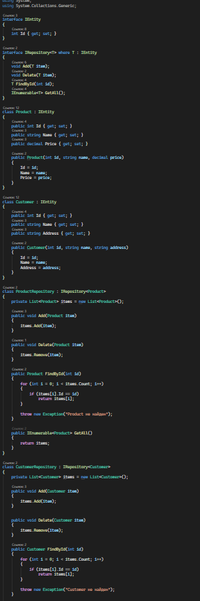
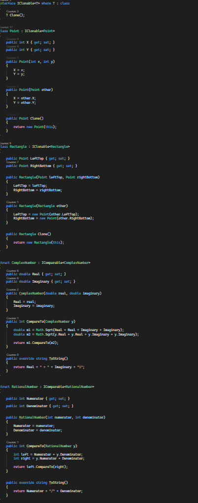
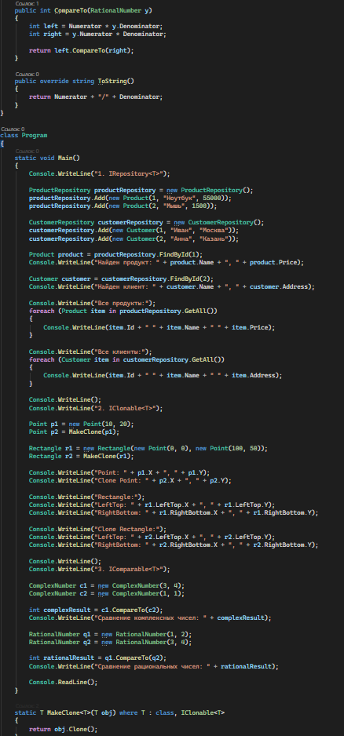
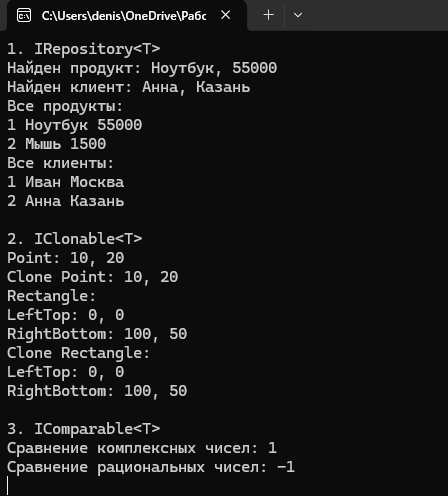

# C# KT10

1. Напишите обобщенный интерфейс IRepository<T>, который содержит методы для работы с данными типа T: void Add(T item), void Delete(T item), T FindById(int id) и IEnumerable<T> GetAll(). Затем напишите ограничение для этого интерфейса, чтобы он мог работать только с типами, которые реализуют интерфейс IEntity, который содержит свойство Id типа int. Затем напишите классы Product и Customer, которые реализуют интерфейс IEntity и имеют свои свойства, такие как Name, Price, Address и т.д. Затем напишите классы ProductRepository и CustomerRepository, которые реализуют интерфейс IRepository<T> для типов Product и Customer соответственно и используют коллекцию типа List<T> для хранения данных.

2. Напишите обобщенный интерфейс IClonable<T>, который содержит метод T Clone(), который возвращает копию объекта типа T. Напишите произвольное ограничение для этого интерфейса. Затем напишите классы Point и Rectangle, которые имеют конструктор с одним параметром типа Point и Rectangle соответственно и реализуют интерфейс IClonable<T> для своих типов. Затем напишите метод, который принимает на вход объект типа T, который реализует интерфейс IClonable<T>, и возвращает его клон с помощью метода Clone().

3. Напишите обобщенный интерфейс IComparable<T>, который содержит метод int CompareTo(T y), который возвращает целое число, указывающее, как текущий объект сравнивается со вторым объектом типа T. Затем напишите структуры ComplexNumber и RationalNumber, которые представляют комплексные числа и рациональные числа соответственно и реализуют интерфейс.

### Код

### Результат

